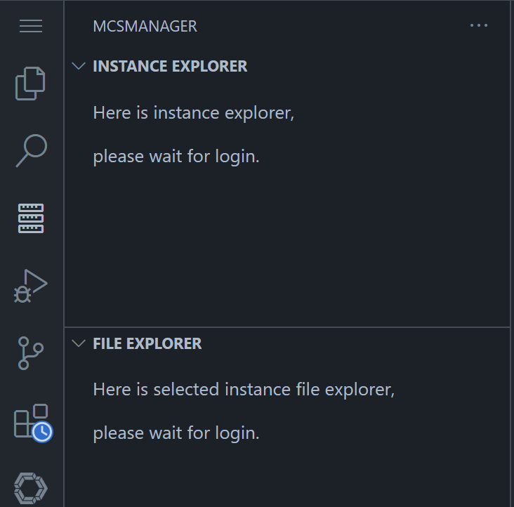
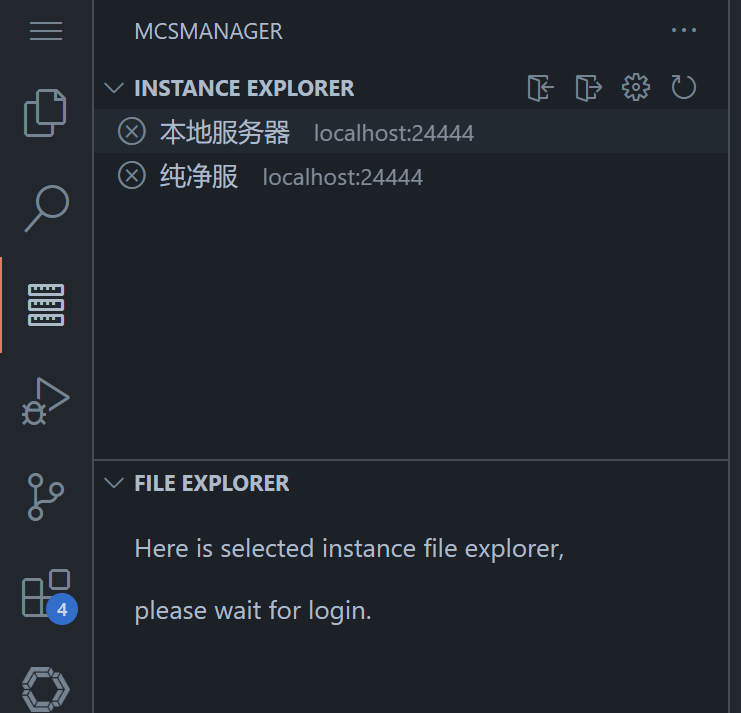
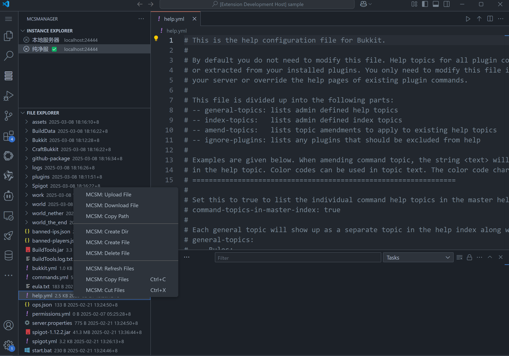
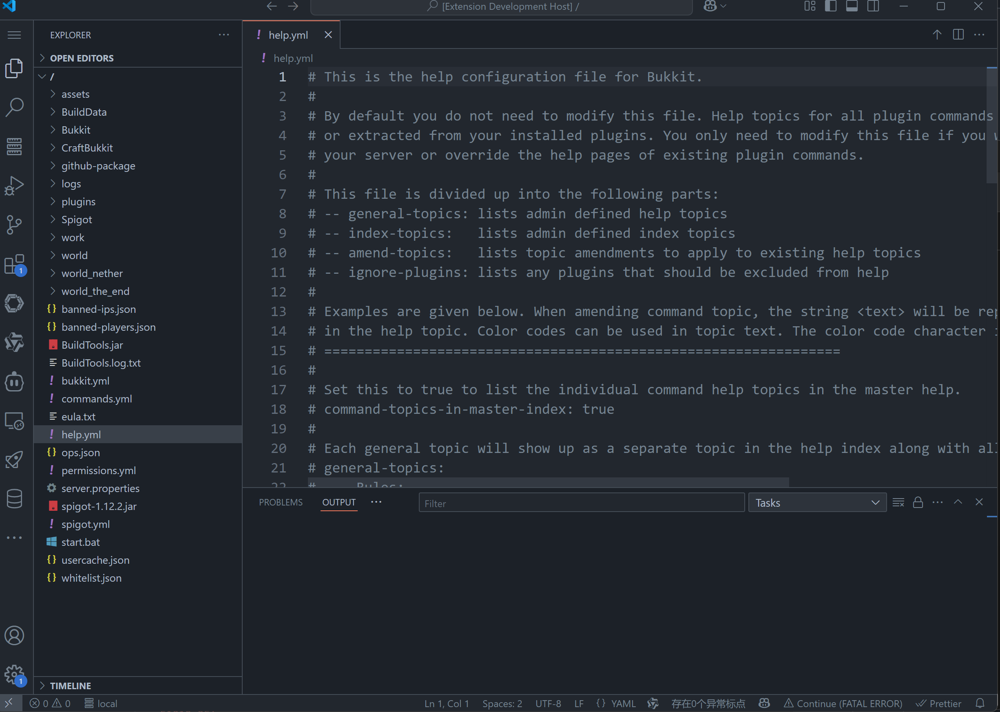
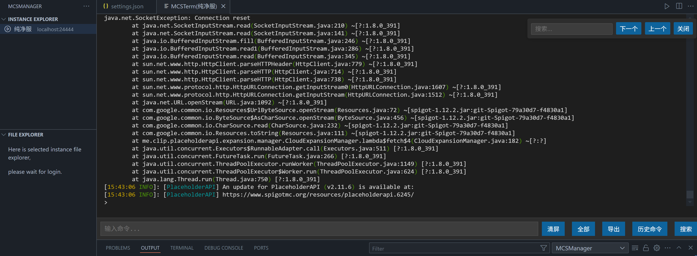

# MCSManager VSCode Extension 🚀

在 VSCode 中使用 MCSManager，让服务器管理更轻松！

## ✨ 功能特性

### 🔑 实例管理
- ✅ 实例列表查看
- ✅ 用户登录与登出
- ✅ 配置文件快速打开
- ✅复制实例信息
- ✅打开实例终端
  - 输入框输入命令，回车执行
  - 拉取终端所有日志（一打开也会）
  - 清屏
  - 导出日志
  - 查看历史命令，点击输入到输入框，在输入框中可按上下键恢复历史命令
  - 搜索日志

- ✅启动、关闭、重启实例
  - 如果实例状态没有修改，可以点击刷新实例按钮

### 📁 文件管理
- ✅实例的文件列表

- ✅双击文件item在编辑器打开文件

  - 为什么双击：这样可以不会影响其他操作，如快捷键，当点击打开，F2重命名文件就很难，Ctrl+X剪切也很难
    - 双击设置在300ms间隔内（我自己认为的合适值）

  - 压缩文件只能下载，无法在编辑器打开
  - ✅ 文件缓存支持：缓存目录结构以及打开过的文件内容
    - ✅ 支持强制刷新根目录、目录、文件（更新内容）
      - 如果是刷新目录，会在关闭编辑器的相关的文件，且让用户自行选择是否重新打开
      - [ ] 支持F5刷新根目录 或者 选中的目录或者文件

- ✅保存文件会自动上传

- view title按钮

  - ✅刷新根目录
  - ✅批量选中删除

- 右键菜单

  - ✅创建文件、目录
    - 在根目录下的文件右键才会上传到根目录
    - [ ] 使用一个菜单操作，先弹出选择框（创建文件、目录、或者是自己写全路径的文件、目录），再弹出输入框输入文件名或者路径

  - ✅删除单个文件

  - ✅文件上传
    - 在根目录下的文件右键才会上传到根目录
  - ✅文件下载
    - 目前仅支持下载文件
    - [ ] 下载目录自动压缩下载

  - ✅重命名
    - ✅支持快捷键F2

  - ✅复制/粘贴操作
    - ✅支持快捷键Ctrl + c、v

  - ✅剪切/粘贴
    - ✅支持快捷键Ctrl + x、v
  - ✅刷新文件/目录
- ✅文件移动（拖拽实现）
  - ✅拖拽到文件会弹出提示是否移动到其目录
- ✅  ai、智能提示在虚拟文件的有效性
- ✅复制文件路径
- [ ] 撤销操作支持（如撤销复制、移动）

### 💼 工作区集成
- ✅File Explorer view title按钮，点击以虚拟工作区打开
- 工作区视图和 mcsFileExplorer 视图更新
  -   打开工作区，更新文件结构后；再打开 file list view 时，不会`fire /`（即视图没有刷新），需要自己监听来刷新
  -   解决方法：都需要 fire
- 资源管理器的 Folder view 刷新会`fire /`（即所有打开的目录）
  - `fire /`
    - window 重新获取焦点时
    - 每次再次显示时，可能会（相对少，感觉可能不是这个引起的）
    - 删除文件时（无论路径是什么）
      - 移动文件仅刷新这个新、旧文件目录，但是看起来好像不是，而是只是刷新了文件元素

### 编辑器集成

- ✅ 标题菜单文件上传（需预选目录，默认根目录）

## 📓日志

- 在panel区域，对于Output View有MCSManager的日志

## 🚨 注意事项

1. **操作提示**

   - vscode

     - 点击是选中tree item（在文件列表里就是一个文件或者目录，背景变灰色），右键只是菜单（边框变蓝色）
       - ctrl+多点击，按ESC会取消选中，但是会呈现右键菜单最后一个的状态（但是又没有显示出菜单，只是item有其状态颜色），再按ESC会取消这个半右键菜单状态
     - 点击tree item后，聚焦其他地方（点击其他地方），不会取消选中，除非再次单击任意一个tree item（会重新选中这个新tree item） 或者 右键再2次ESC 或者 ctrl+点击+一次ESC
       - 注意这个，避免操作失误（只要注意tree item颜色即可）
     - 右键显示菜单不会取消选中tree item

     

   - 重新打开工作目录后，若文件显示打开失败，请等待文件列表加载完成后重试

   - 快捷键：一但不显示文件管理器，就需要重新选择，防止误操作

2. **性能考虑**

   - 批量移动/删除文件会逐个执行，不建议在工作区进行大量文件操作

## 🔄 其他更新计划

- [x] 统一提示文本语言（改为全英文）
- [x] 自定义空视图
- ❌使用 VSCode 内置认证方式authentication
  - 没啥用，还是不用这个了
- [ ] 对接websocket，执行命令

# 图片展示

## 空视图

## 未选中实例

## 使用示例

## 虚拟工作区实例

## 终端

